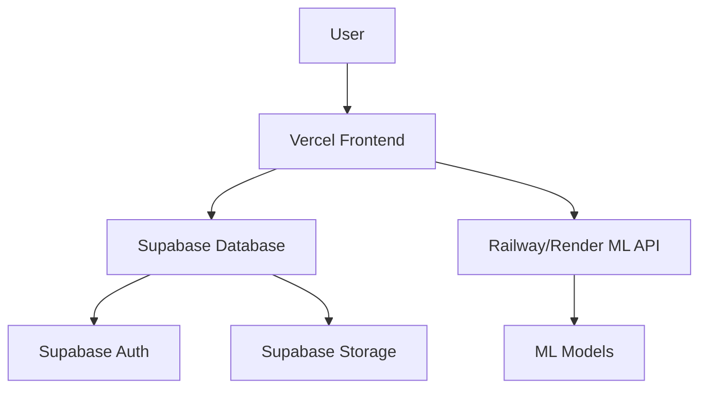

# DirectRent UK - Complete Vercel Deployment Guide

This guide provides step-by-step instructions to deploy the DirectRent UK project to Vercel with full functionality, including the ML API services.

## 🚀 Deployment Architecture Overview



## 📋 Pre-Deployment Checklist

### ✅ Required Services Setup
- [ ] Supabase project with database schema applied
- [ ] GitHub repository with your code
- [ ] Vercel account
- [ ] Railway or Render account (for ML API)
- [ ] Google Maps API key (optional)

## 🎯 Step 1: Prepare Your Project for Deployment

### 1.1 Optimize Next.js Configuration

Update [`next.config.js`](next.config.js):

```javascript
/** @type {import('next').NextConfig} */
const nextConfig = {
  experimental: {
    serverComponentsExternalPackages: ['@supabase/supabase-js']
  },
  images: {
    domains: [
      'your-supabase-project.supabase.co',
      'images.unsplash.com',
      'via.placeholder.com'
    ],
    remotePatterns: [
      {
        protocol: 'https',
        hostname: '**.supabase.co',
        port: '',
        pathname: '/storage/v1/object/public/**',
      },
    ],
  },
  env: {
    NEXT_PUBLIC_SUPABASE_URL: process.env.NEXT_PUBLIC_SUPABASE_URL,
    NEXT_PUBLIC_SUPABASE_ANON_KEY: process.env.NEXT_PUBLIC_SUPABASE_ANON_KEY,
    NEXT_PUBLIC_ML_API_URL: process.env.NEXT_PUBLIC_ML_API_URL,
  }
}

module.exports = nextConfig
```

### 1.2 Create Vercel Configuration

Create [`vercel.json`](vercel.json) in the root directory:

```json
{
  "framework": "nextjs",
  "buildCommand": "npm run build",
  "devCommand": "npm run dev",
  "installCommand": "npm install",
  "functions": {
    "app/api/**/*.ts": {
      "maxDuration": 30
    }
  },
  "env": {
    "NEXT_PUBLIC_SUPABASE_URL": "@supabase_url",
    "NEXT_PUBLIC_SUPABASE_ANON_KEY": "@supabase_anon_key",
    "SUPABASE_SERVICE_ROLE_KEY": "@supabase_service_key",
    "NEXT_PUBLIC_ML_API_URL": "@ml_api_url",
    "NEXT_PUBLIC_GOOGLE_MAPS_API_KEY": "@google_maps_key"
  },
  "build": {
    "env": {
      "NEXT_PUBLIC_SUPABASE_URL": "@supabase_url",
      "NEXT_PUBLIC_SUPABASE_ANON_KEY": "@supabase_anon_key"
    }
  }
}
```

### 1.3 Update Package.json Scripts

Ensure your [`package.json`](package.json) has the correct scripts:

```json
{
  "scripts": {
    "dev": "next dev",
    "build": "next build",
    "start": "next start",
    "lint": "next lint",
    "type-check": "tsc --noEmit",
    "postbuild": "next-sitemap"
  }
}
```

## 🎯 Step 2: Deploy ML API to Railway

### 2.1 Prepare ML API for Deployment

Create [`ml-api/requirements.txt`](ml-api/requirements.txt):

```txt
fastapi==0.104.1
uvicorn[standard]==0.24.0
pandas==2.1.3
scikit-learn==1.3.2
numpy==1.25.2
pydantic==2.5.0
python-multipart==0.0.6
joblib==1.3.2
```

Create [`ml-api/Dockerfile`](ml-api/Dockerfile):

```dockerfile
FROM python:3.11-slim

WORKDIR /app

COPY requirements.txt .
RUN pip install --no-cache-dir -r requirements.txt

COPY . .

EXPOSE 8000

CMD ["uvicorn", "main:app", "--host", "0.0.0.0", "--port", "8000"]
```

Create [`ml-api/railway.toml`](ml-api/railway.toml):

```toml
[build]
builder = "DOCKERFILE"
dockerfilePath = "Dockerfile"

[deploy]
startCommand = "uvicorn main:app --host 0.0.0.0 --port $PORT"
healthcheckPath = "/health"
healthcheckTimeout = 100
restartPolicyType = "ON_FAILURE"
restartPolicyMaxRetries = 10
```

### 2.2 Deploy to Railway

1. **Create Railway Account**: Go to [railway.app](https://railway.app)

2. **Connect GitHub Repository**:
   ```bash
   # Install Railway CLI
   npm install -g @railway/cli
   
   # Login to Railway
   railway login
   
   # Initialize project
   railway init
   ```

3. **Deploy ML API**:
   ```bash
   cd ml-api
   railway up
   ```

4. **Set Environment Variables** in Railway dashboard:
   ```env
   PORT=8000
   PYTHONPATH=/app
   ```

5. **Get Railway URL**: Note the deployed URL (e.g., `https://your-app.railway.app`)

### 2.3 Alternative: Deploy to Render

1. **Create Render Account**: Go to [render.com](https://render.com)

2. **Create Web Service**:
   - Connect GitHub repository
   - Root directory: `ml-api`
   - Build command: `pip install -r requirements.txt`
   - Start command: `uvicorn main:app --host 0.0.0.0 --port $PORT`

3. **Environment Variables**:
   ```env
   PYTHON_VERSION=3.11.0
   ```

## 🎯 Step 3: Deploy Frontend to Vercel

### 3.1 Connect GitHub Repository

1. **Go to Vercel Dashboard**: [vercel.com/dashboard](https://vercel.com/dashboard)

2. **Import Project**:
   - Click "New Project"
   - Import from GitHub
   - Select your DirectRent UK repository

3. **Configure Project**:
   - Framework Preset: Next.js
   - Root Directory: `./` (leave empty if root)
   - Build Command: `npm run build`
   - Output Directory: `.next` (auto-detected)
   - Install Command: `npm install`

### 3.2 Set Environment Variables

In Vercel dashboard → Settings → Environment Variables, add:

```env
# Supabase Configuration
NEXT_PUBLIC_SUPABASE_URL=https://your-project.supabase.co
NEXT_PUBLIC_SUPABASE_ANON_KEY=your_supabase_anon_key
SUPABASE_SERVICE_ROLE_KEY=your_supabase_service_role_key

# ML API Configuration
NEXT_PUBLIC_ML_API_URL=https://your-ml-api.railway.app

# Google Maps (Optional)
NEXT_PUBLIC_GOOGLE_MAPS_API_KEY=your_google_maps_api_key

# App Configuration
NEXT_PUBLIC_APP_URL=https://your-app.vercel.app
NEXTAUTH_URL=https://your-app.vercel.app
NEXTAUTH_SECRET=your_nextauth_secret_key
```

### 3.3 Configure Domains

1. **Custom Domain** (Optional):
   - Go to Settings → Domains
   - Add your custom domain
   - Configure DNS records

2. **SSL Certificate**: Automatically provided by Vercel

## 🎯 Step 4: Configure Supabase for Production

### 4.1 Update Supabase Settings

1. **Authentication Settings**:
   - Go to Authentication → Settings
   - Add your Vercel domain to "Site URL"
   - Add redirect URLs:
     ```
     https://your-app.vercel.app/auth/callback
     https://your-app.vercel.app/dashboard
     ```

2. **CORS Settings**:
   - Go to Settings → API
   - Add your Vercel domain to allowed origins

3. **Storage Settings**:
   - Go to Storage → Settings
   - Configure public bucket for property images
   - Set up RLS policies for file access

### 4.2 Database Optimization

Execute these SQL commands in Supabase SQL Editor:

```sql
-- Create indexes for better performance
CREATE INDEX CONCURRENTLY IF NOT EXISTS idx_properties_search 
ON properties USING GIN (to_tsvector('english', title || ' ' || description));

CREATE INDEX CONCURRENTLY IF NOT EXISTS idx_properties_location_price 
ON properties (city, price_per_month) WHERE is_active = true;

CREATE INDEX CONCURRENTLY IF NOT EXISTS idx_properties_type_bedrooms 
ON properties (property_type, bedrooms) WHERE is_active = true;

-- Optimize RLS policies
ALTER TABLE properties ENABLE ROW LEVEL SECURITY;
ALTER TABLE bookings ENABLE ROW LEVEL SECURITY;
ALTER TABLE reviews ENABLE ROW LEVEL SECURITY;
```

## 🎯 Step 5: Test Deployment

### 5.1 Frontend Testing

Visit your Vercel URL and test:

- [ ] Homepage loads correctly
- [ ] Property search functionality
- [ ] User registration/login
- [ ] Property listing creation
- [ ] Image uploads
- [ ] Responsive design on mobile

### 5.2 API Testing

Test API endpoints:

```bash
# Test property search
curl "https://your-app.vercel.app/api/properties?city=London&limit=5"

# Test ML API
curl "https://your-ml-api.railway.app/health"

# Test recommendations
curl -X POST "https://your-ml-api.railway.app/recommendations" \
  -H "Content-Type: application/json" \
  -d '{"user_id": "test", "preferences": {"price_max": 2000}}'
```

### 5.3 Database Testing

Verify database operations:

- [ ] User registration creates database entries
- [ ] Property listings are saved correctly
- [ ] Bookings are processed
- [ ] File uploads work with Supabase Storage

## 🎯 Step 6: Performance Optimization

### 6.1 Next.js Optimizations

Update [`next.config.js`](next.config.js) for production:

```javascript
const nextConfig = {
  // Enable compression
  compress: true,
  
  // Optimize images
  images: {
    formats: ['image/webp', 'image/avif'],
    minimumCacheTTL: 60,
  },
  
  // Enable SWC minification
  swcMinify: true,
  
  // Optimize bundles
  experimental: {
    optimizeCss: true,
    optimizePackageImports: ['@heroicons/react', 'lucide-react'],
  },
  
  // Headers for caching
  async headers() {
    return [
      {
        source: '/(.*)',
        headers: [
          {
            key: 'X-Frame-Options',
            value: 'DENY',
          },
          {
            key: 'X-Content-Type-Options',
            value: 'nosniff',
          },
        ],
      },
    ]
  },
}
```

### 6.2 Database Performance

```sql
-- Analyze query performance
ANALYZE properties;
ANALYZE bookings;
ANALYZE users;

-- Create materialized view for popular searches
CREATE MATERIALIZED VIEW popular_properties AS
SELECT p.*, COUNT(pv.id) as view_count
FROM properties p
LEFT JOIN property_views pv ON p.id = pv.property_id
WHERE p.is_active = true
GROUP BY p.id
ORDER BY view_count DESC;

-- Refresh materialized view (run periodically)
REFRESH MATERIALIZED VIEW popular_properties;
```

## 🎯 Step 7: Monitoring and Analytics

### 7.1 Vercel Analytics

Enable in Vercel dashboard:
- Go to Analytics tab
- Enable Web Analytics
- Enable Speed Insights

### 7.2 Error Monitoring

Add Sentry (optional):

```bash
npm install @sentry/nextjs
```

Create [`sentry.client.config.js`](sentry.client.config.js):

```javascript
import * as Sentry from '@sentry/nextjs'

Sentry.init({
  dsn: process.env.NEXT_PUBLIC_SENTRY_DSN,
  tracesSampleRate: 1.0,
})
```

### 7.3 Uptime Monitoring

Set up monitoring for:
- Frontend: `https://your-app.vercel.app`
- ML API: `https://your-ml-api.railway.app/health`
- Database: Supabase dashboard monitoring

## 🎯 Step 8: Security Configuration

### 8.1 Environment Security

```bash
# Generate secure secrets
openssl rand -base64 32  # For NEXTAUTH_SECRET
```

### 8.2 Content Security Policy

Add to [`next.config.js`](next.config.js):

```javascript
const securityHeaders = [
  {
    key: 'Content-Security-Policy',
    value: `
      default-src 'self';
      script-src 'self' 'unsafe-eval' 'unsafe-inline' *.vercel.app;
      style-src 'self' 'unsafe-inline';
      img-src 'self' data: https: *.supabase.co;
      connect-src 'self' *.supabase.co *.railway.app;
    `.replace(/\s{2,}/g, ' ').trim()
  }
]

module.exports = {
  async headers() {
    return [
      {
        source: '/(.*)',
        headers: securityHeaders,
      },
    ]
  },
}
```

## 🎯 Step 9: Custom Domain Setup (Optional)

### 9.1 Configure DNS

For your custom domain:

```dns
# A Record
@ → 76.76.19.61

# CNAME Record
www → your-app.vercel.app
```

### 9.2 Update Environment Variables

```env
NEXT_PUBLIC_APP_URL=https://yourdomain.com
NEXTAUTH_URL=https://yourdomain.com
```

## 🎯 Step 10: Deployment Automation

### 10.1 GitHub Actions (Optional)

Create [`.github/workflows/deploy.yml`](.github/workflows/deploy.yml):

```yaml
name: Deploy to Vercel

on:
  push:
    branches: [main]
  pull_request:
    branches: [main]

jobs:
  deploy:
    runs-on: ubuntu-latest
    steps:
      - uses: actions/checkout@v2
      
      - name: Setup Node.js
        uses: actions/setup-node@v2
        with:
          node-version: '18'
          
      - name: Install dependencies
        run: npm ci
        
      - name: Run tests
        run: npm run test
        
      - name: Build project
        run: npm run build
        
      - name: Deploy to Vercel
        uses: amondnet/vercel-action@v20
        with:
          vercel-token: ${{ secrets.VERCEL_TOKEN }}
          vercel-org-id: ${{ secrets.ORG_ID }}
          vercel-project-id: ${{ secrets.PROJECT_ID }}
```

## 🚨 Troubleshooting Common Issues

### Build Errors

1. **TypeScript Errors**:
   ```bash
   npm run type-check
   # Fix any type errors before deployment
   ```

2. **Missing Environment Variables**:
   - Check Vercel dashboard → Settings → Environment Variables
   - Ensure all required variables are set

3. **Import Errors**:
   ```javascript
   // Use dynamic imports for client-side only code
   const Component = dynamic(() => import('./Component'), { ssr: false })
   ```

### Runtime Errors

1. **Supabase Connection Issues**:
   - Verify environment variables
   - Check Supabase project status
   - Ensure RLS policies allow access

2. **ML API Connection Issues**:
   - Verify Railway/Render deployment status
   - Check CORS configuration
   - Test API endpoints directly

### Performance Issues

1. **Slow Loading**:
   - Enable Next.js Image optimization
   - Implement proper caching headers
   - Use Vercel Analytics to identify bottlenecks

2. **Database Slow Queries**:
   - Check Supabase performance insights
   - Add appropriate indexes
   - Optimize complex queries

## 📊 Post-Deployment Checklist

### ✅ Functionality Testing
- [ ] User registration and login
- [ ] Property search and filtering
- [ ] Property listing creation
- [ ] Image uploads
- [ ] Booking system
- [ ] ML recommendations
- [ ] Fraud detection
- [ ] Price estimation
- [ ] Email notifications
- [ ] Mobile responsiveness

### ✅ Performance Testing
- [ ] Page load speeds < 3 seconds
- [ ] Core Web Vitals scores
- [ ] API response times < 500ms
- [ ] Database query performance
- [ ] Image optimization working

### ✅ Security Testing
- [ ] HTTPS enabled
- [ ] Environment variables secure
- [ ] Authentication working
- [ ] Authorization rules enforced
- [ ] Input validation active
- [ ] CORS properly configured

## 🎉 Deployment Complete!

Your DirectRent UK application is now live with full functionality:

- **Frontend**: Deployed on Vercel with optimized performance
- **Backend**: Supabase database with real-time features
- **ML API**: Railway/Render deployment with AI capabilities
- **Security**: Production-ready security configurations
- **Monitoring**: Analytics and error tracking enabled

### 🔗 Important URLs

- **Production Site**: `https://your-app.vercel.app`
- **ML API**: `https://your-ml-api.railway.app`
- **Supabase Dashboard**: `https://app.supabase.com/project/your-project`
- **Vercel Dashboard**: `https://vercel.com/dashboard`

### 📞 Support Resources

- **Vercel Documentation**: [vercel.com/docs](https://vercel.com/docs)
- **Supabase Documentation**: [supabase.com/docs](https://supabase.com/docs)
- **Railway Documentation**: [docs.railway.app](https://docs.railway.app)
- **Next.js Documentation**: [nextjs.org/docs](https://nextjs.org/docs)

Your DirectRent UK platform is now ready to serve users with a complete property rental experience!
